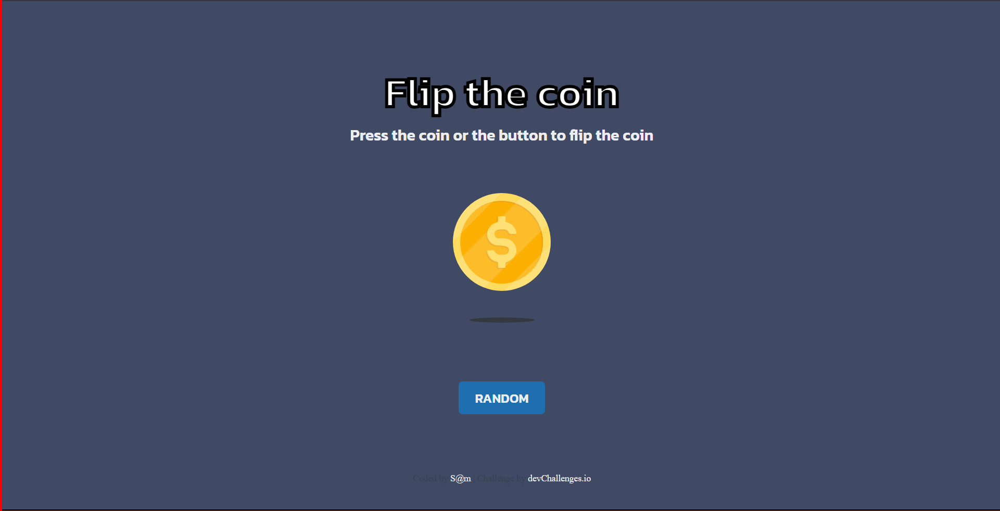

<!-- Please update value in the {}  -->

<h1 align="center">Flip The Coin | devChallenges</h1>

   Solution for a challenge <a href="https://devchallenges.io/challenge/flip-the-coin" target="_blank">Flip The Coin</a> from <a href="http://devchallenges.io" target="_blank">devChallenges.io</a>.

  <h3>
    <a href="{https://your-demo-link.your-domain}">
      Demo
    </a>
     | 
    <a href="{https://your-url-to-the-solution}">
      Solution
    </a>
     | 
    <a href="https://devchallenges.io/challenge/flip-the-coin">
      Challenge
    </a>
  </h3>

<!-- TABLE OF CONTENTS -->

## Table of Contents

- [Overview](#overview)
  - [What I learned](#what-i-learned)
  - [Useful resources](#useful-resources)
- [Built with](#built-with)
- [Features](#features)
- [Contact](#contact)
- [Acknowledgements](#acknowledgements)

<!-- OVERVIEW -->

## Overview

### What I learned

In this project, I learned how to effectively use JavaScript to manipulate the DOM and create interactive user experiences. I improved my understanding of event listeners and how to handle user interactions dynamically. Additionally, I gained experience in debugging and optimizing code for better performance. This project also helped me enhance my CSS skills, particularly in creating responsive designs and animations.

### Useful resources

- [MDN Web Docs](https://developer.mozilla.org/) - This is an excellent resource for understanding JavaScript, CSS, and HTML concepts. It helped me clarify DOM manipulation and event handling.
- [CSS Tricks](https://css-tricks.com/) - This site provided valuable insights into CSS animations and responsive design techniques.
- [JavaScript.info](https://javascript.info/) - This comprehensive guide helped me deepen my understanding of JavaScript fundamentals and advanced topics.
- [Stack Overflow](https://stackoverflow.com/) - A great platform for troubleshooting and finding solutions to specific coding challenges I encountered during the project.
- [Google Fonts](https://fonts.google.com/) - Used for selecting and integrating custom fonts into the project.

>

### Built with

- Semantic HTML5
- CSS3
- JavaScript
- Flexbox
- CSS Grid
- Responsive Design Techniques
- DOM Manipulation
- Event Listeners
- Git and GitHub for version control
- Visual Studio Code
- Google Fonts

## Features

- Flip a virtual coin with a single click.
- Real-time coin flipping animation.
- Responsive and user-friendly design.
- Lightweight, fast, and customizable.
- Cross-browser compatible with no external dependencies.
- Open-source and optimized for performance.
- Encourages learning JavaScript and CSS through practical application.

This application/site was created as a submission to a [DevChallenges](https://devchallenges.io/challenges-dashboard) challenge.

## Acknowledgements

I would like to acknowledge the various articles, tutorials, and resources that played a crucial role in the completion of this project. These resources not only provided guidance but also helped me expand my knowledge and skills in web development. Special thanks to:

- [MDN Web Docs](https://developer.mozilla.org/) for their extensive documentation on web technologies.
- [CSS Tricks](https://css-tricks.com/) for their practical tips and tricks on CSS design and animations.
- [JavaScript.info](https://javascript.info/) for their detailed explanations of JavaScript concepts.
- [Stack Overflow](https://stackoverflow.com/) for being an invaluable platform for troubleshooting and finding solutions to coding challenges.

These resources have been instrumental in helping me overcome obstacles and achieve the desired outcomes for this project.

## Author

- Website [your-website.com](https://{your-web-site-link}) => i don't have yet.
- GitHub [@sonabuwa](https://github.com/sonabuwa)
